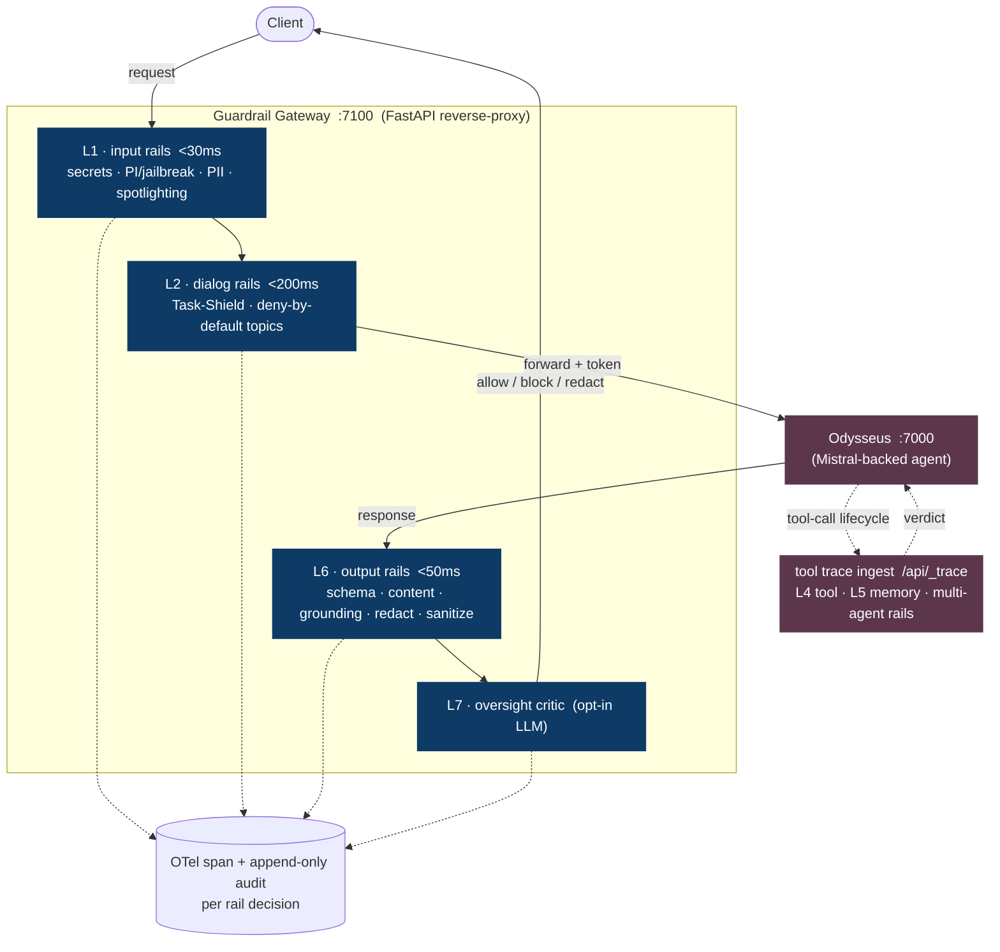
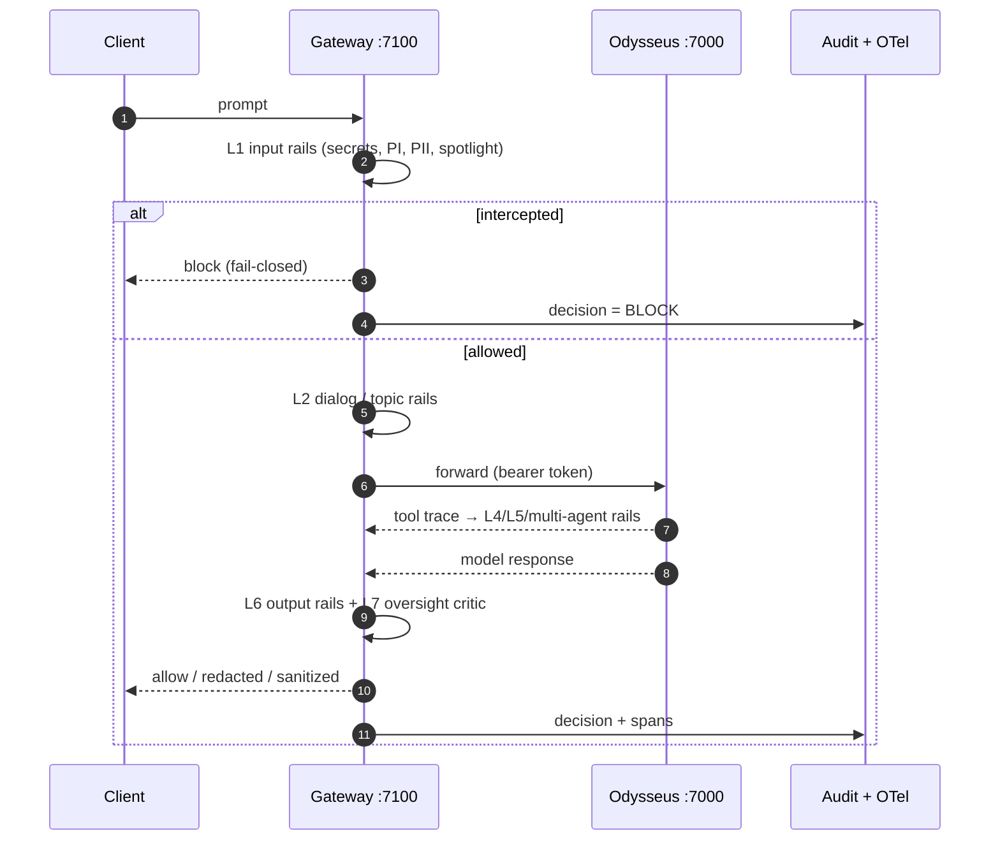
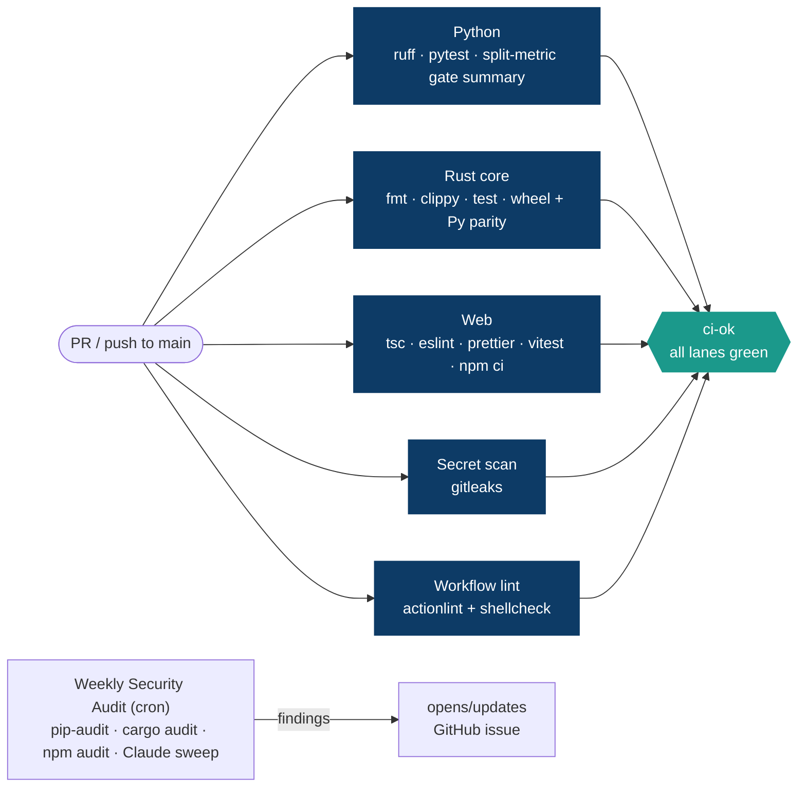

# SEC_Guardrails_Agent

[](https://github.com/krishddd/SEC_Guardrails_Agent/actions/workflows/ci.yml)
[](https://pypi.org/project/sec-guardrails/)
[](https://krishddd.github.io/SEC_Guardrails_Agent/)
[](#license)
[](pyproject.toml)

Defensive, build-from-scratch **7-layer runtime guardrails** for the **Odysseus** autonomous agent
(Docker, local port `7000`, Mistral-backed). A non-invasive reverse-proxy **guardrail gateway** runs on
port `7100` in front of Odysseus, enforces a chain of rails on every turn, and emits an OpenTelemetry
trace + an append-only audit record for each rail decision.

> **Defensive only.** This repo defends an agent; it does not attack one. The offensive red-team and the
> scorer are separate, existing projects — reused here, never rebuilt (see [Ecosystem](#ecosystem)).

---

## Why

An LLM agent that plans, runs tools (bash, document creation, web/API calls), reads untrusted external
data, and holds memory has a large attack surface — prompt injection, tool misuse, memory poisoning,
data exfiltration. Guardrails are the runtime control plane that decides, at every boundary, whether
what the agent is about to **read, say, or do** is allowed. The design follows two principles
throughout: **defense-in-depth** (no single check is trusted) and **treat all external content as
untrusted** (provenance labels + taint tracking).

## Architecture

The gateway is a reverse proxy: every turn passes through input + dialog rails on the way in, the
tool trace is checked mid-flight, and output + oversight rails run before the response reaches the
client. Each decision emits an OpenTelemetry span and an append-only audit record.



The **7 control layers**: L1 input · L2 dialog/topic · L3 reasoning/IFC (dual-LLM + taint) · L4
tool/action · L5 retrieval/memory · multi-agent comms · L7 verification/oversight · (+ L6 output) ·
cross-cutting observability. Each layer maps to specific attacks it defends — see
[`docs/architecture/odysseus-guardrails.md`](docs/architecture/odysseus-guardrails.md).

### Request lifecycle



## Polyglot stack — each language where it earns its place

| Language | Role | Why |
|---|---|---|
| **Python 3.11** | Control plane: FastAPI gateway, classifier orchestration, eval harness | Glue + ML ecosystem |
| **Rust** (PyO3/maturin → `guardrails_core`) | Deterministic security core: secrets scanner, spotlighting, URL/HTML sanitizer, **L4 policy-DSL parser+evaluator**, taint primitives | Memory safety *is* a security property at a trust boundary; meets the <30 ms budget. Pure-Python fallback included |
| **TypeScript/React** (Vite, `web/`) | HITL approval app + observability/audit dashboard | Human-facing surfaces a headless service can't provide. No security logic client-side |
| **Rego/OPA** | L4 policy v2 path | Git-versioned, CI-testable policy when the in-house DSL outgrows itself |

See [ADR-0006](docs/architecture/adr/0006-polyglot-rust-core.md) and
[ADR-0007](docs/architecture/adr/0007-typescript-frontend.md).

## Ecosystem (sibling projects — reused, not rebuilt)

- **Offensive oracle** — `Agent_security_testing/Security_module` (ASI01–10 + ext01–17). The attack
  suite the guardrails are evaluated against (A/B: direct vs. via gateway).
- **Scorer** — `Agent eval pipeline` (Odysseus quality/safety metrics, grounding judge).
- **Target** — `odysseus/` (the agent under protection).

## How it's built — research-doc-driven pipeline

Every phase reads/writes a structured markdown artifact under `docs/`, driven by Claude Code skills:

```
research/ → docs/specs/ → docs/architecture/ (+adr) → docs/plans/ → code
/research-distill → /explore → /design → /plan → /scaffold → /implement → /test → /review → /docs-sync → /ship
```

## Install & harness

Building an agent service and need runtime guardrails? Drop `sec-guardrails` in front of it — the
7-layer rail chain (prompt-injection, PII/secrets, output exfiltration, tool policy, memory poisoning,
oversight) runs on every turn, no security logic in your app. Released on PyPI as
[`sec-guardrails`](https://pypi.org/project/sec-guardrails/):

```bash
pip install sec-guardrails               # control plane; ".[ml]" / ".[bench]" / ".[llm]" add extras
```

Run the gateway in front of Odysseus, straight from the console entry point:

```bash
sec-guardrails serve --port 7100         # → point Odysseus at http://localhost:7100/api/_trace
sec-guardrails version
```

Harness it from any Python / agentic pipeline — the public API is stable at the top of `sec_guardrails`:

```python
from sec_guardrails import build_default_app, create_gateway_app

# Turnkey (Odysseus): fully-wired FastAPI app — mount it, or serve with uvicorn.
app = build_default_app()

# Your own agent: pass a client that speaks the same chat contract, plus your audit sink / rail engine.
app = create_gateway_app(my_client, audit=my_audit, engine=my_engine)
```

The distribution ships a single clean top-level package (`sec_guardrails`) — no generic module names
leak into your environment.

## Quickstart (from source)

```bash
# 1. Install (control plane; Rust core + ML detectors are extras)
python -m pip install -e ".[dev]"          # ".[ml]" deberta/Presidio · ".[bench]" AgentDojo · ".[llm]" L7 critic

# 2. Tests + lint
pytest -q                                   # 277 pass; Rust↔Python parity runs in CI
ruff check . && ruff format --check .

# 3. See every layer fire end-to-end (no external services needed)
python scripts/demo.py

# 4. Run the guardrail gateway on :7100 in front of Odysseus :7000
python scripts/run_gateway.py
#    → point Odysseus at it: GUARDRAIL_TRACE_URL=http://localhost:7100/api/_trace

# 5. Live A/B (red-team direct vs via the engine) and the AgentDojo benchmark
python scripts/run_ab_live.py               # AB_USE_ML=1 to use the deberta backend
python scripts/run_benchmark_live.py
```

Configuration is via environment variables (see [`.env.example`](.env.example)); `.env` is never
committed. Reuses `ODYSSEUS_TOKEN` + `OPENAI_API_KEY` from the eval pipeline — **rotate the OpenAI key
before use**.

## Repository layout

| Path | Purpose |
|---|---|
| `research/` | Raw research / intake digests |
| `docs/specs/` | Distilled, structured specs |
| `docs/architecture/` | Exploration notes, architecture doc, ADRs |
| `docs/plans/` | Ordered, checkable task lists (`T1–T40`) |
| `src/sec_guardrails/` | Installable package (`pip install sec-guardrails`); public API + CLI at its top level |
| `src/sec_guardrails/gateway/` | FastAPI reverse-proxy gateway (`:7100`) |
| `src/sec_guardrails/rails/` | Rail implementations (input/dialog/output/tool/memory/reasoning/multiagent/oversight) |
| `src/sec_guardrails/core/` | Rail framework, config, audit, observability |
| `src/sec_guardrails/eval/` | A/B attack harness, AgentDojo benchmark driver, latency/FPR reporting |
| `src/sec_guardrails/agent/` | Reference tool-executing agent that runs *under* the engine (in-process trace) |
| `docs/eval/` | Measured A/B, benchmark, latency, and defense-upgrade results |
| `crates/guardrails-core/` | Rust security core (PyO3/maturin → `guardrails_core`) |
| `web/` | TypeScript/React HITL approval + observability dashboard |
| `tests/` | Unit + adversarial fixtures, offline Odysseus stub |
| `.claude/` | Skills, subagents, pre-edit guard hook, settings |

## CI/CD pipeline

Every PR runs six required lanes; `ci-ok` aggregates them so branch protection can gate on one
check. A weekly audit files a GitHub issue on findings, and Dependabot updates arrive grouped.



Hardening in place: third-party actions pinned by commit SHA, `persist-credentials: false` on every
checkout, committed lockfiles (`web/package-lock.json` + crate `Cargo.lock`) with `npm ci`,
`timeout-minutes` on every job, and `cancel-in-progress` concurrency on CI + the review workflow.
See [`docs/plans/pipeline-improvements.md`](docs/plans/pipeline-improvements.md) (P1–P13).

## Testing & quality gates

Per-language gates, all green on the current branch:

| Lane | Command | Result |
|---|---|---|
| Python | `pytest -q` | **277 passed, 14 skipped** |
| Python | `ruff check .` + `ruff format --check .` | clean |
| Rust core | `cargo fmt --check` + `cargo clippy -D warnings` + `cargo test` | clean; Rust↔Python parity on shared `tests/vectors/` |
| Web | `tsc --noEmit` (TypeScript 7) | clean |
| Web | `eslint .` + `prettier --check .` | clean |
| Web | `vitest run` | **4 passed** |
| Workflows | `actionlint` + `shellcheck` | clean on all 3 workflows |
| Secrets | `gitleaks` | no leaks |

Security metrics are reported **split** (ASR/interception vs. FPR/utility) and printed into the CI
job summary on every run via [`scripts/gate_summary.py`](scripts/gate_summary.py) — never a single
blended F1.

> **Note on the web eslint lane:** `typescript-eslint` does not yet support TypeScript 7 (peer
> `typescript <6.1.0`). While the app tracks TS 7, eslint lints JS/config only; the `.ts`/`.tsx`
> sources stay covered by `tsc --noEmit` (types) and `prettier --check` (style). Re-add
> `typescript-eslint` once it ships TS 7 support.

## Evaluation & results

Security metrics are always reported **split** — Attack Success Rate (ASR) / interception and
false-positive (FPR) / utility separately, **never a single blended F1**. The A/B harness runs the
Security_module attacks direct vs. through the gateway against live Odysseus; AgentDojo runs as a
reused external benchmark. Full write-ups in [`docs/eval/`](docs/eval/).

**Measured against live Odysseus** (interception = fraction of attacks hard-blocked; the deterministic,
attributable metric):

| suite | metric | result |
|---|---|---|
| Security_module (red-team) | overall interception, heuristic → ML | **0.19 → 0.47** |
| Security_module | role-reassignment interception (after detector upgrade) | **0.00 → 1.00** |
| AgentDojo (banking/slack/travel/workspace) | injection interception | **1.00** (12/12) |
| all suites | **FPR / over-refusal** | **0.00** |
| indirect injection (XPIA) via a poisoned tool result | caught at the gateway, live | ✅ |
| N2 token-level sanitization (poisoned-but-useful suite) | ASR / utility / FPR (split) | **0.00 / 1.00 / 0.00** |

Latency: deterministic input rails < 15 ms p50; the ML detector (deberta-v3, 323 ms CPU) runs only on
gray-band inputs via a conditional second stage, so benign traffic pays ~0 (see
[`docs/architecture/T7-latency-spike.md`](docs/architecture/T7-latency-spike.md)).

## Status

- ✅ **Foundations, all 7 rail layers, Rust core, React HITL/dashboard, CI** — the full safety net.
- ✅ **Unified `GuardrailEngine`** + reference guarded agent; agent-agnostic `guard_*` API.
- ✅ **Live integration** — `:7100` gateway fronting Odysseus; tool-trace ingest (`/api/_trace`),
  live A/B (Security_module) and AgentDojo benchmark, latency spike with real ML models.
- ✅ **Defense R&D (D1–D5)** — detector recall upgrade, conditional second stage, ensemble +
  PromptGuard 2 backend, and tool-output (indirect/XPIA) scanning proven live.
- ✅ **Next-gen rails (N-series, 2026-07)** — **N1** deterministic function-call argument-schema
  rail (L4); **N2** token-level tool-output sanitization (CommandSans-style: injected spans
  stripped, benign data survives, fail-closed re-scan — utility 0 → 1.0 on the poisoned suite);
  **N8** opt-in LLM oversight critic (L7) wired into the live gateway path.
- ✅ **CI/CD pipeline (P1–P13)** — split ASR/FPR gate summary on every run, grouped Dependabot
  updates, SHA-pinned third-party actions, and a weekly security audit that files a GitHub issue on
  findings. **Latest hardening (P8–P13):** fixed a fail-open weekly CVE scan (was auditing an empty
  env), committed lockfiles + `npm ci`, a real eslint/prettier web lane, polyglot audit coverage
  (`pip-audit` + `cargo audit` + `npm audit`), per-job `timeout-minutes`, review-workflow
  concurrency, and an `actionlint` + `shellcheck` workflow-lint lane.

Run `python scripts/demo.py` to watch every layer fire end-to-end. Track detail in
[`docs/plans/odysseus-guardrails-plan.md`](docs/plans/odysseus-guardrails-plan.md), the defense
roadmap in [`docs/plans/defense-improvements.md`](docs/plans/defense-improvements.md), and the
next-generation plan in [`docs/plans/next-gen-guardrails.md`](docs/plans/next-gen-guardrails.md).

## Security

Found a vulnerability? See [`SECURITY.md`](SECURITY.md). Do not open a public issue for sensitive
reports.

## License

[MIT](LICENSE) © Harish. Free to use, modify, and redistribute — defensive tooling meant to be
harnessed widely.
